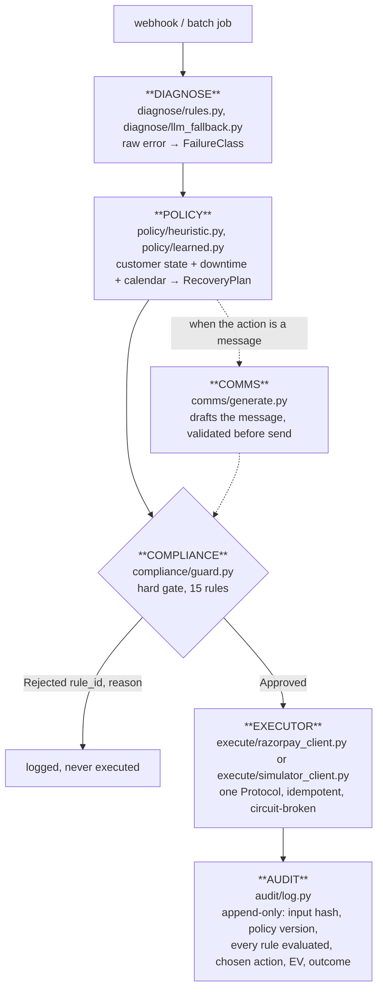

# Architecture

Revora turns a failed recurring payment into a bounded, auditable, RBI-compliant recovery
attempt. This document is the flow, the `Executor` Protocol trick that makes the benchmark
honest, the compliance guard, and the audit trail — the four things worth understanding before
reading the code.

## The flow



Diagnose classifies *why* the payment failed. Rules first (`diagnose/rules.py` — every error
code the simulator or Razorpay itself can produce maps deterministically); the LLM
(`diagnose/llm_fallback.py`) only ever sees a string that didn't match, and its output is
constrained to the `FailureClass` enum plus a confidence score — a low-confidence or failed
classification becomes `UNKNOWN`, never a guess presented as certainty.

Policy decides *whether, when, and on which rail* to retry, producing a `RecoveryPlan` — a
bounded sequence of `Attempt`s plus a `StopRule`. Three implementations share one `Policy`
Protocol (`policy/base.py`): `HeuristicPolicy` (payday-aware, downtime-gated, rule-table
driven), `LearnedPolicy` (a LightGBM hazard model estimates `P(success | t, class, context)`
and an EV planner picks the slot that maximizes expected recovery minus contact cost), and four
baselines (`policy/baselines.py`) standing in for what merchants actually run today —
`razorpay_default` mirrors Razorpay's documented subscription retry schedule.

Compliance is the one hard gate every money action and every customer message passes through,
covered in detail below.

Executor is the one place a decision touches the outside world — described below.

Audit writes one append-only row *before* the action executes, then a second row for the
outcome once it's known. Nothing here is ever updated or deleted; `audit/log.py`'s
`AuditLog` class has no `update_decision` method, on purpose.

## The Executor Protocol trick

```python
# execute/protocol.py
class Executor(Protocol):
    def execute(self, invoice: Invoice, attempt: Attempt, t: datetime, idempotency_key: str) -> AttemptOutcome: ...
```

Two implementations, one Protocol, and the policy layer genuinely cannot tell them apart:

- **`SimulatorClient`** (`execute/simulator_client.py`) resolves an attempt against a causal
  generative world (`sim/world.py`) — latent customer balance, mandate state, issuer
  availability — none of which the policy layer ever sees directly. This is what `make bench`
  runs against, 2,000 invoices at a time.
- **`RazorpayClient`** (`execute/razorpay_client.py`) resolves the same call against real
  Razorpay test-mode APIs. `CONTACT_LINK` creates a real Payment Link; `SILENT_RETRY` fetches
  the payment's real status, since there is no merchant-callable API to force a mandate retry —
  e-NACH and UPI Autopay retries run on Razorpay's own schedule, and `RazorpayClient` is honest
  about that limit rather than pretending otherwise.

This is why the benchmark is honest: the same `HeuristicPolicy`/`LearnedPolicy` code that
decides against the simulator is the code that would decide against the real API. There is no
separate "demo mode" branch anywhere in `policy/`.

Idempotency and resilience live entirely inside `RazorpayClient`, since the Executor
Protocol's caller (the benchmark harness, or the live loop) never retries anything itself:

- **Idempotency (invariant 6).** Every `Attempt` carries a deterministic key —
  `f"{invoice_id}:{attempt_index}:{action_type}"`. Razorpay's Payment Links API has no
  idempotency-key header (unlike its Payouts and Refunds APIs), so `RazorpayClient` enforces
  it itself: before ever calling `payment_link.create()`, it checks `LiveStore` for a row
  already recorded under that key and reuses the existing link instead of creating a second
  one.
- **Backoff and circuit breaking.** `razorpay.errors.ServerError` and connection-level
  failures are retried with exponential backoff, reusing the same idempotency key. After
  several consecutive exhausted calls, a circuit breaker opens and further calls fail fast
  without touching the network — surfaced on the dashboard as the `razorpay` degraded badge.
  `BadRequestError` is a genuine rejection, never retried.

`SimulatorClient` and `RazorpayClient` are the only two files that construct an
`AttemptOutcome`; `execute/razorpay_client.py` is the only file in the repo that imports
`razorpay` (invariant 5).

## The compliance guard

`ComplianceGuard.evaluate()` (`compliance/guard.py`) runs every rule in `compliance/rules.py`
against a proposed plan and returns `Approved` or `Rejected(rule_id, reason)` — it never
silently mutates a plan, and it evaluates *every* rule rather than short-circuiting on the
first failure, so the audit row always shows the full picture. Fifteen rules, each an
independent, pure, table-tested function of `(Attempt, RuleContext)`:

| Rule | Guards against |
|---|---|
| `R001_PRE_DEBIT_NOTICE` | debiting without the required advance notice |
| `R002_AFA_THRESHOLD` | debiting above the AFA-free ceiling without additional factor authentication |
| `R003_MAX_SILENT_ATTEMPTS` | retrying a mandate more times than the cap allows |
| `R004_ATTEMPT_WINDOW` | retrying outside the bounded recovery window |
| `R005_MIN_INTERVAL_SAME_PATH` | re-attempting the same action too soon |
| `R006_HARD_DECLINE_NO_RETRY` | retrying a hard decline at all (expired card, revoked mandate, blocked instrument, risk check) |
| `R007_MANDATE_ACTIVE` | debiting against a mandate that isn't active |
| `R008_MANDATE_CAP` | debiting above the mandate's own registered ceiling |
| `R009_CONTACT_QUIET_HOURS` | messaging a customer during quiet hours (IST) |
| `R010_MESSAGE_FREQUENCY` | messaging more often than the cap allows |
| `R011_ISSUER_RATE_LIMIT` | slamming an issuer with a retry storm the moment it comes back from downtime |
| `R012_CUSTOMER_OPT_OUT` | contacting a customer who opted out |
| `R013_PROMISE_TO_PAY_SUPPRESSION` | chasing a customer who has an active promise-to-pay |
| `R014_MESSAGE_CONTENT` | sending a message whose amount, date or merchant name don't match the record verbatim, or that's missing the opt-out line |
| `R015_ISSUER_DOWNTIME_GATE` | debiting through an issuer/rail currently reporting `severity: high`, unresolved downtime |

Every numeric constant in `compliance/constants.py` carries a source comment — an RBI
circular, an NPCI guideline, or a Razorpay-documented limit — never a bare magic number.
`R015` has no numeric constant at all: its source is the downtime event itself, read live from
`payment.fetchDownTime()` in the live loop and from the simulator's issuer-availability process
in the benchmark, same schema either way (`domain/types.py`'s `DowntimeWindow`).

`tests/test_compliance_invariants.py` runs every policy arm end to end and asserts zero
compliance violations across every attempt generated — this is the test the whole project
answers to; it is never marked `xfail`, skipped, or loosened. If it fails, the policy is wrong,
not the test.

## The audit trail

`audit/log.py`'s `AuditLog` writes to two append-only SQLite tables, `DecisionRow` and
`OutcomeRow`. Every decision is recorded *before* the action executes (invariant 7):

```python
class Decision(FrozenModel):
    invoice_id: str
    attempt_index: int
    decided_at: AwareDatetime
    input_snapshot_hash: str        # hash of exactly what the policy saw
    policy_version: str
    compliance_verdict: ComplianceVerdict   # every rule, every outcome
    chosen_action: ActionType
    expected_value: Money
```

The outcome — success, recovered amount, failure reason — is written separately once it's
known, never by mutating the decision row. `audit/explain.py` turns a structured decision
record into one human sentence via the LLM for the dashboard's decision inspector; the
structured record stays authoritative and the sentence is never load-bearing — a rule this
codebase takes literally: nothing in `policy/` or `compliance/` ever reads an LLM's output.

## Live vs. benchmark, side by side

| | Benchmark (`make bench`) | Live (`make up`, `make live`) |
|---|---|---|
| Trigger | `scripts/bench.py` runs a batch | `POST /webhooks/razorpay`, or `scripts/live_demo.py`'s manual steps |
| Executor | `SimulatorClient` against `sim/world.py` | `RazorpayClient` against real Razorpay test-mode APIs |
| Scale | 2,000 invoices / 500 customers / 90 days | 1 invoice per webhook delivery, or 1 demo subscription |
| State | in-memory `Cohort`, one `AuditLog` per arm | `api/store.py`'s `LiveStore` (open invoices, dedup, dead letters), plus the same `AuditLog` |
| Success known | synchronously, from `World.attempt()` | asynchronously — a `payment_link.paid` webhook, consumed by `api/webhooks.py` |

Everything upstream of the executor — diagnose, policy, compliance — is the exact same code
in both columns.
