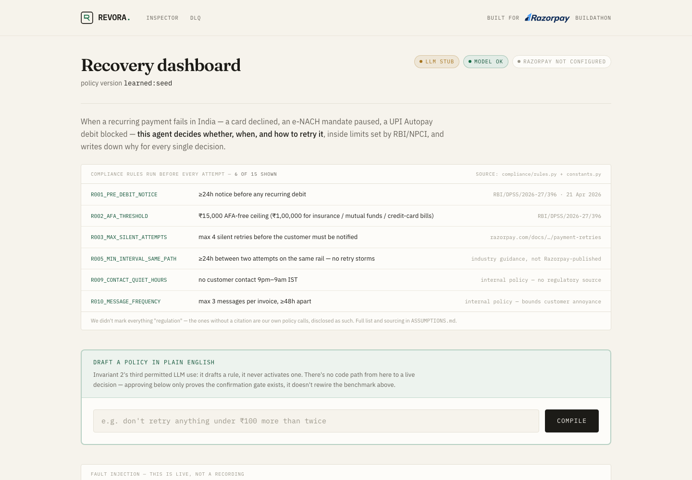
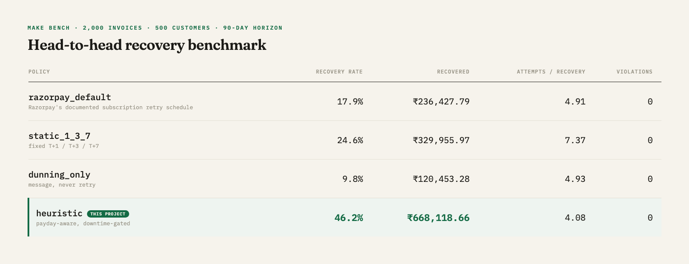
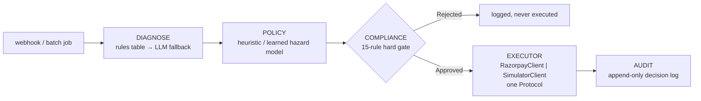
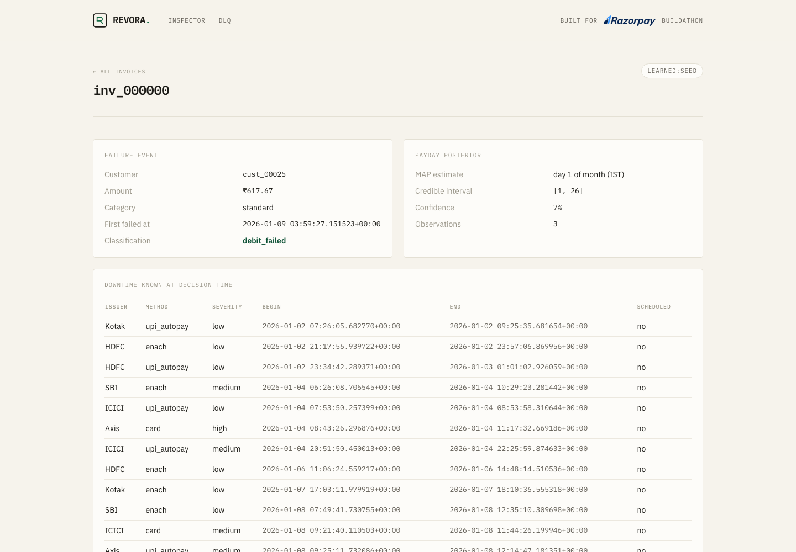
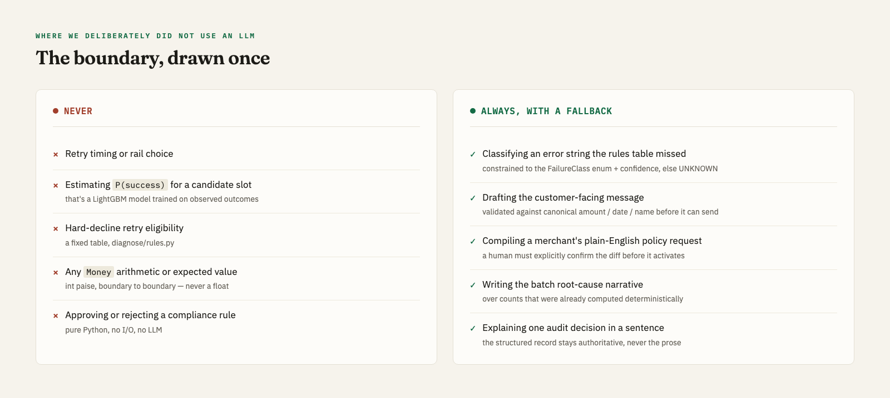

<div align="center">


<br><br>

<a href="https://github.com/sujalbistaa/razorpay-buildathon/actions/workflows/ci.yml"></a>


</div>

<br>

An autonomous recovery agent for failed recurring payments in India: it decides *whether,
when, and on which rail* to retry each failed debit, executes a bounded RBI-compliant recovery
workflow with explicit stopping rules, and reports rupees recovered against Razorpay's own
documented retry baseline — with a full, append-only audit trail and zero compliance
violations, asserted by a test that fails the build if that ever stops being true.

<br>

## The number

<div align="center">

### `heuristic` recovers **2.6×** the invoices and **2.8×** the rupees of Razorpay's own documented retry schedule

**46.2%** vs 17.9% recovery rate · **₹668,118.66** vs ₹236,427.79 recovered · same 2,000-invoice batch · **0** compliance violations, either arm

</div>

<br>



<br>

Measured by `make bench` against a 2,000-invoice / 500-customer / 90-day simulated cohort,
committed at [benchmarks/results.json](benchmarks/results.json) so you see it without running
anything:



<details>
<summary>Same table, as text</summary>
<br>

| Policy | Recovery rate | Recovered | Attempts/recovery | Compliance violations |
|---|---|---|---|---|
| `razorpay_default` (the baseline — Razorpay's documented subscription retry schedule) | 17.9% | ₹236,427.79 | 4.91 | 0 |
| `static_1_3_7` (fixed T+1/T+3/T+7) | 24.6% | ₹329,955.97 | 7.37 | 0 |
| `dunning_only` (message, never retry) | 9.8% | ₹120,453.28 | 4.93 | 0 |
| **`heuristic`** (this project — payday-aware, downtime-gated) | **46.2%** | **₹668,118.66** | 4.08 | 0 |

</details>

`learned` — a LightGBM hazard model estimating `P(success | t, class, context)` behind an
expected-value planner — is trained on one held-out half of the cohort (cohort A) and scored
only on the other (cohort B, 938 invoices never seen during training), paired directly against
`razorpay_default` on the identical population:

> **+₹234.57 recovered per invoice** (learned − razorpay_default), 95% bootstrap CI
> **[₹205.74, ₹264.25]**, 2,000 resamples.

That lift survives real misspecification, not just this one seed. Re-running with
`world.yaml`'s parameters perturbed ±30–50% — payday distribution shifted, downtime rate
doubled, hard-decline mix tripled, engagement halved — the paired lift over
`razorpay_default` never drops below **+159%** and reaches **+321%** under a halved-engagement
world (full table: [benchmarks/robustness.md](benchmarks/robustness.md)). This sweep, not the
headline number, is the credible claim — see **What this is not**, below.

Where the lift comes from, isolated one mechanism at a time
([benchmarks/ablation.png](benchmarks/ablation.png)): reason-awareness alone recovers
₹228,404.80 on cohort B; adding payday inference brings it to ₹282,645.73; adding EV-based
stopping, ₹330,641.70; adding dunning messages for genuinely unrecoverable invoices,
₹331,373.50 (`learned`'s final number above). Reason-awareness and payday timing are the
dominant contributors in this run — worth saying plainly rather than crediting every mechanism
equally.

<br>

## Architecture



Full detail — the `Executor` Protocol trick that makes the benchmark honest, every compliance
rule, and how the audit trail is structured — is in [ARCHITECTURE.md](ARCHITECTURE.md). Why
each of those choices won over its alternative — SQLite not Postgres, `Protocol` not
inheritance, Thompson sampling not epsilon-greedy, Groq-then-Gemini, no Celery/Redis — is in
[DESIGN_DECISIONS.md](DESIGN_DECISIONS.md). Six real bugs hit while building this, each one
symptom → root cause → fix, are in [ENGINEERING_LOG.md](ENGINEERING_LOG.md).

Click any invoice on the dashboard and the decision inspector shows the *entire* reasoning
chain behind one decision — not a summary of it:



<br>

## Run it — `docker compose up`

```
git clone <this repo>
cd revora
docker compose up
```

Open `localhost:8000`. Measured cold (no cached layers, no `.env` file): **77 seconds** from
`docker compose up` to the dashboard responding, dominated entirely by dependency install
(LightGBM, pandas, matplotlib) — the app itself starts serving within 2 seconds of the
container coming up. No API keys required: the LLM runs in stub mode (rules-first
classification, template messages — see below), and the dashboard boots with a small seeded
cohort so there's a full reasoning chain to click through immediately, alongside the real
`benchmarks/results.json` numbers above.

- **Dashboard** (`/`) — at-risk queue, recovery-by-failure-class, the head-to-head chart above, degraded-mode badges (`llm` / `model` / `razorpay`).
- **Decision inspector** (`/inspector`) — click any seeded invoice: the failure event, classification, inferred payday with its credible interval, downtime state at decision time, every compliance rule evaluated, candidate slots with their expected values, the chosen action, the stop rule, the outcome.
- **DLQ** (`/admin/dlq`) — webhook deliveries whose processing raised, held for inspection and manual replay.

<br>

## Watch it fail on purpose


`make chaos` — real code paths, not a mock: an LLM client forced to raise mid-call, a
genuinely corrupted LightGBM model file, a Razorpay client made to return 5xx until the
circuit breaker trips, the same webhook event ID delivered twice, a malformed queue message.
Every scenario asserts the system degraded the way CLAUDE.md says it must — a `degraded` flag
set, a fallback taken, never a crash, never a silently wrong number — not just that it didn't
throw. The dashboard's fault-injection panel (`/#chaos-panel`) runs the same LLM/model/Razorpay
toggles live, from the browser, against the running process.

<br>

## Webhook ingestion latency, measured

The one externally-facing endpoint (`POST /webhooks/razorpay`) has a documented latency claim
in its own module docstring — "ack within 200ms, enqueue." `make load` (`scripts/load_test.py`)
checks that against a real running instance rather than leaving it asserted: its own
subprocess, its own scratch SQLite file, 500 individually-HMAC-signed requests at concurrency
50 over real loopback TCP, torn down after. Measured on the machine this was built on:

| Metric | Value |
|---|---|
| Requests | 500, concurrency 50, 0 non-200 |
| p50 | 66.32 ms |
| p95 | 87.74 ms |
| p99 | 91.95 ms |
| max | 94.27 ms |

Run `make load` yourself — this isn't a number to take on faith, and it'll vary by machine.

<br>

## Where we deliberately did not use an LLM

The LLM never decides timing, probability, retry eligibility, or anything that touches money
arithmetic. The boundary is drawn once and held everywhere:



Groq/Gemini unavailable → rules and templates, logged, `degraded: llm` on the dashboard,
`make bench` produces the identical number either way (`tests/test_llm_fallback.py` proves
this directly, not just by matching totals).

<details>
<summary>Module references for the five "always, with a fallback" uses</summary>
<br>

- Unmapped-error classification — `diagnose/llm_fallback.py`, constrained to the `FailureClass` enum plus a confidence score
- Customer-facing messages — `comms/generate.py`, English / Hindi / Hinglish, validated before send
- Natural-language policy compilation — `llm/policy_compiler.py`, typed and Pydantic-validated
- Batch root-cause narrative — `llm/narrative.py`, over deterministically-computed counts
- Audit decision explanation — `audit/explain.py`, structured record stays authoritative

</details>

<br>

## What this is not

> The 2,000-invoice batch is synthetic. The lift is measured against a simulator whose
> parameters are documented in [ASSUMPTIONS.md](ASSUMPTIONS.md), sourced where public sources
> exist and marked as estimates where they don't. The learned policy is trained on data
> generated by that simulator, so the absolute number is not a forecast of real-world
> performance; the robustness sweep above is there to show which part of the result survives
> parameter misspecification. On real merchant data the hazard model would need recalibration
> and the payday prior would be re-fit. The live loop against Razorpay test-mode APIs is one
> subscription end to end, not the batch.

<br>

<details>
<summary><b>Repo map</b></summary>

```
revora/
├── README.md, ARCHITECTURE.md, ASSUMPTIONS.md, ENGINEERING_LOG.md, DESIGN_DECISIONS.md
├── docker-compose.yml, Dockerfile, Makefile, pyproject.toml, .env.example
├── src/vasool/         Python package name predates the Revora rebrand; unchanged internally
│   ├── domain/        types, enums, Money (int paise), FailureClass, Attempt, RecoveryPlan
│   ├── diagnose/       rules table, LLM fallback classifier
│   ├── policy/         baselines, heuristic, learned, hazard model, payday inference, planner, Thompson exploration
│   ├── compliance/      rule engine (15 rules), sourced constants, per-issuer token buckets
│   ├── execute/         RazorpayClient | SimulatorClient — one Protocol, idempotency, circuit breaker
│   ├── comms/           message generation, validators, templates
│   ├── audit/           append-only decision log, LLM explanation layer
│   ├── sim/              causal generative world, world.yaml, cohort generation
│   ├── bench/            harness, metrics, ablation, robustness sweep, plots
│   ├── api/              webhooks, dashboard, decision inspector, admin DLQ
│   ├── llm/              Groq client with a Gemini fallback (stub-mode too), narrative, policy compiler
│   └── chaos.py          `make chaos` — 7 fault-injection scenarios
├── scripts/              seed.py, bench.py, live_demo.py, load_test.py
├── tests/                324 tests: table-driven compliance cases, hypothesis property tests
│                         (hundreds of randomized inputs per run against 4 rules), determinism,
│                         idempotency, and test_compliance_invariants.py
└── benchmarks/            results.json, report.md, robustness.md, plots — committed deliberately
```

</details>

<details>
<summary><b>Running the benchmark</b></summary>

<br>

```
make install     # creates .venv, installs the pinned toolchain
make bench       # regenerates benchmarks/results.json, report.md, the plots above (~90s)
make test        # 324 tests, ~13s, includes test_compliance_invariants.py
make chaos       # 7 fault-injection scenarios against the real code paths above (~2s)
make load        # p50/p99 webhook ingestion latency against a real running instance (~5s)
```

`benchmarks/results.json` and the report PNGs are committed deliberately — you see the number
above without running anything. `make bench` reproduces it from the same seed, byte for byte
(`tests/test_determinism.py` asserts this).

</details>

<details>
<summary><b>Running the live loop</b></summary>

<br>

```
make up          # dashboard + webhook receiver at localhost:8000, seeded data, no credentials needed
make live        # scripts/live_demo.py — one real recovery loop against a real Razorpay test-mode account
```

`make live` needs real `RAZORPAY_KEY_ID` / `RAZORPAY_KEY_SECRET` **test-mode** credentials in
your environment (copy `.env.example` → `.env`) and walks you through it interactively: create
a Plan and Subscription, authorize the mandate in your browser, trigger a real "Charge as
Failure" from the Razorpay Dashboard (test-mode only, no API for it), then Revora classifies
the real failure, decides with the real policy layer, and creates a real test-mode Payment
Link. It polls Razorpay's fetch APIs rather than consuming real webhooks — receiving a real
webhook needs a public HTTPS tunnel pointed at `make up`, out of scope for a single unattended
script — documented in the script's own header. Test-mode limits that apply: max 30 Payment
Links per business, card tokens valid 3 days, UPI Payment Links are not available in test mode
at all.

</details>

<br>

<div align="center">

built by Sujal Bist

</div>
