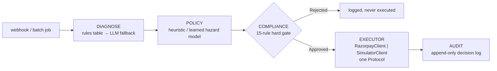

<div align="center">


<br><br>

<a href="https://github.com/sujalbistaa/razorpay-buildathon/actions/workflows/ci.yml"></a>


</div>

<br>

Revora is an autonomous recovery agent for failed recurring payments in India. It decides
*whether, when, and on which rail* to retry a failed debit, runs a bounded RBI-compliant
recovery workflow with clear stopping rules, and reports how many rupees it actually recovered
against Razorpay's own documented retry baseline. Every action gets logged to a full,
append-only audit trail, and there's a test that fails the build the moment a compliance
violation shows up — not a claim I'm making here, something CI actually checks on every push.

**Live:** [100.63.108.251:8000](http://100.63.108.251:8000) — running this exact code on a real AWS box, not just locally.

<br>


## The number

<div align="center">

### `heuristic` recovers **2.6×** the invoices and **2.8×** the rupees of Razorpay's own documented retry schedule

**46.2%** vs 17.9% recovery rate · **₹668,118.66** vs ₹236,427.79 recovered · same 2,000-invoice batch · **0** compliance violations, either arm

</div>

<br>


<br>

This comes from `make bench` running against a 2,000-invoice / 500-customer / 90-day simulated
cohort. The result is committed at [benchmarks/results.json](benchmarks/results.json), so you
can see it without running anything yourself:


<details>
<summary>Same table, as text</summary>
<br>

| Policy | Recovery rate | Recovered | Attempts/recovery | Compliance violations |
|---|---|---|---|---|
| `razorpay_default` (the baseline — Razorpay's documented subscription retry schedule) | 17.9% | ₹236,427.79 | 4.91 | 0 |
| `static_1_3_7` (fixed T+1/T+3/T+7) | 24.6% | ₹329,955.97 | 7.37 | 0 |
| `dunning_only` (message, never retry) | 9.8% | ₹120,453.28 | 4.93 | 0 |
| **`heuristic`** (this project — payday-aware, downtime-gated) | **46.2%** | **₹668,118.66** | 4.08 | 0 |

</details>

There's a fifth arm, `learned`: a LightGBM hazard model that estimates
`P(success | t, class, context)` feeding an expected-value planner. I trained it on one
held-out half of the cohort (cohort A) and scored it only on the other half (cohort B — 938
invoices it never saw during training), paired directly against `razorpay_default` on the
exact same population:

> **+₹234.57 recovered per invoice** (learned − razorpay_default), 95% bootstrap CI
> **[₹205.74, ₹264.25]**, 2,000 resamples.

That lift isn't a one-seed fluke either. I re-ran the whole thing with `world.yaml`'s
parameters perturbed ±30–50% — payday distribution shifted, downtime rate doubled,
hard-decline mix tripled, engagement halved — and the paired lift over `razorpay_default`
never dropped below **+159%**, reaching **+321%** under the halved-engagement world (full
table in [benchmarks/robustness.md](benchmarks/robustness.md)). Honestly, that sweep is the
claim worth trusting here, more than the single headline number above — see **What this is
not**, below.

Where does the lift actually come from? I isolated each mechanism one at a time
([benchmarks/ablation.png](benchmarks/ablation.png)): reason-awareness alone recovers
₹228,404.80 on cohort B, adding payday inference brings it to ₹282,645.73, adding EV-based
stopping gets to ₹330,641.70, and adding dunning messages for genuinely unrecoverable
invoices reaches ₹331,373.50 (that's `learned`'s final number above). Reason-awareness and
payday timing are doing most of the work in this run — I'd rather say that plainly than
pretend every mechanism contributed equally.

<br>

## Architecture



The full detail — the `Executor` Protocol trick that keeps the benchmark honest, every
compliance rule, how the audit trail is actually structured — lives in
[ARCHITECTURE.md](ARCHITECTURE.md). Why I picked each of these over the alternative (SQLite
over Postgres, `Protocol` over inheritance, Thompson sampling over epsilon-greedy, Groq before
Gemini, no Celery or Redis) is in [DESIGN_DECISIONS.md](DESIGN_DECISIONS.md). And six real
bugs I actually hit while building this — symptom, root cause, fix, each one — are written up
in [ENGINEERING_LOG.md](ENGINEERING_LOG.md).

Click any invoice on the dashboard and the decision inspector shows the *entire* reasoning
chain behind that one decision, not a summary of it:


<br>

## Run it — `docker compose up`

```
git clone <this repo>
cd revora
docker compose up
```

Open `localhost:8000`. I measured this cold — no cached layers, no `.env` file — and got
**77 seconds** from `docker compose up` to the dashboard actually responding. Almost all of
that is dependency install (LightGBM, pandas, matplotlib); the app itself starts serving
within 2 seconds once the container's up. You don't need any API keys: the LLM runs in stub
mode by default (rules-first classification, template messages — more on that below), and the
dashboard boots with a small seeded cohort so there's a full reasoning chain to click through
right away, alongside the real `benchmarks/results.json` numbers above.

- **Dashboard** (`/`) — at-risk queue, recovery-by-failure-class, the head-to-head chart above, degraded-mode badges (`llm` / `model` / `razorpay`).
- **Decision inspector** (`/inspector`) — click any seeded invoice: the failure event, classification, inferred payday with its credible interval, downtime state at decision time, every compliance rule evaluated, candidate slots with their expected values, the chosen action, the stop rule, the outcome.
- **DLQ** (`/admin/dlq`) — webhook deliveries whose processing raised, held for inspection and manual replay.

<br>

## Watch it fail on purpose


`make chaos` runs against real code paths, not mocks: an LLM client forced to raise mid-call,
a genuinely corrupted LightGBM model file, a Razorpay client made to return 5xx until the
circuit breaker trips, the same webhook event ID delivered twice, a malformed queue message.
Each scenario checks that the system degraded the way CLAUDE.md says it has to — a `degraded`
flag actually set, a fallback actually taken, no crash, no silently wrong number — not just
that nothing threw an exception. The dashboard's fault-injection panel (`/#chaos-panel`) runs
the same LLM/model/Razorpay toggles live, from the browser, against the process that's
actually running.

<br>

## Webhook ingestion latency, measured

The one endpoint the outside world actually talks to (`POST /webhooks/razorpay`) has a latency
claim written right into its own module docstring: "ack within 200ms, enqueue." Rather than
leave that as an assertion, `make load` (`scripts/load_test.py`) checks it against a real
running instance — its own subprocess, its own scratch SQLite file, 500 individually
HMAC-signed requests at concurrency 50 over real loopback TCP, torn down afterward. Measured
on the machine I built this on:

| Metric | Value |
|---|---|
| Requests | 500, concurrency 50, 0 non-200 |
| p50 | 66.32 ms |
| p95 | 87.74 ms |
| p99 | 91.95 ms |
| max | 94.27 ms |

Run `make load` yourself. This isn't a number I want you to take on faith, and it'll vary by
machine anyway.

<br>

## Where we deliberately did not use an LLM

The LLM never decides timing, probability, retry eligibility, or anything that touches money
arithmetic. I drew that boundary once, at the start, and held it everywhere:


If Groq and Gemini are both unavailable, the system falls back to rules and templates, logs
it, and shows `degraded: llm` on the dashboard — and `make bench` produces the exact same
number either way. `tests/test_llm_fallback.py` proves that directly, not just by comparing
totals at the end.

<details>
<summary>Module references for the five "always, with a fallback" uses</summary>
<br>

- Unmapped-error classification — `diagnose/llm_fallback.py`, constrained to the `FailureClass` enum plus a confidence score
- Customer-facing messages — `comms/generate.py`, English / Hindi / Hinglish, validated before send
- Natural-language policy compilation — `llm/policy_compiler.py`, typed and Pydantic-validated
- Batch root-cause narrative — `llm/narrative.py`, over deterministically-computed counts
- Audit decision explanation — `audit/explain.py`, structured record stays authoritative

</details>

<br>

## What this is not

> The 2,000-invoice batch is synthetic — I'm not going to pretend otherwise. The lift is
> measured against a simulator whose parameters are documented in
> [ASSUMPTIONS.md](ASSUMPTIONS.md): sourced where a public source actually exists, marked as
> an estimate where it doesn't. The learned policy trains on data that same simulator
> generated, so the absolute number isn't a forecast of real-world performance. The robustness
> sweep above exists to show which part of the result survives when the simulator's
> parameters are wrong. On real merchant data, the hazard model would need recalibrating and
> the payday prior would need re-fitting. And the live loop against Razorpay test-mode APIs is
> one subscription end to end — not the batch.

<br>

<details>
<summary><b>Repo map</b></summary>

```
revora/
├── README.md, ARCHITECTURE.md, ASSUMPTIONS.md, ENGINEERING_LOG.md, DESIGN_DECISIONS.md
├── docker-compose.yml, Dockerfile, Makefile, pyproject.toml, .env.example
├── src/vasool/         Python package name predates the Revora rebrand; unchanged internally
│   ├── domain/        types, enums, Money (int paise), FailureClass, Attempt, RecoveryPlan
│   ├── diagnose/       rules table, LLM fallback classifier
│   ├── policy/         baselines, heuristic, learned, hazard model, payday inference, planner, Thompson exploration
│   ├── compliance/      rule engine (15 rules), sourced constants, per-issuer token buckets
│   ├── execute/         RazorpayClient | SimulatorClient — one Protocol, idempotency, circuit breaker
│   ├── comms/           message generation, validators, templates
│   ├── audit/           append-only decision log, LLM explanation layer
│   ├── sim/              causal generative world, world.yaml, cohort generation
│   ├── bench/            harness, metrics, ablation, robustness sweep, plots
│   ├── api/              webhooks, dashboard, decision inspector, admin DLQ
│   ├── llm/              Groq client with a Gemini fallback (stub-mode too), narrative, policy compiler
│   └── chaos.py          `make chaos` — 7 fault-injection scenarios
├── scripts/              seed.py, bench.py, live_demo.py, load_test.py
├── tests/                325 tests: table-driven compliance cases, hypothesis property tests
│                         (hundreds of randomized inputs per run against 4 rules), determinism,
│                         idempotency, and test_compliance_invariants.py
└── benchmarks/            results.json, report.md, robustness.md, plots — committed deliberately
```

</details>

<details>
<summary><b>Running the benchmark</b></summary>

<br>

```
make install     # creates .venv, installs the pinned toolchain
make bench       # regenerates benchmarks/results.json, report.md, the plots above (~90s)
make test        # 325 tests, ~13s, includes test_compliance_invariants.py
make chaos       # 7 fault-injection scenarios against the real code paths above (~2s)
make load        # p50/p99 webhook ingestion latency against a real running instance (~5s)
```

`benchmarks/results.json` and the report PNGs are committed on purpose, so you see the number
above without running anything yourself. `make bench` reproduces it from the same seed, byte
for byte — `tests/test_determinism.py` is what actually checks that.

</details>

<details>
<summary><b>Running the live loop</b></summary>

<br>

```
make up          # dashboard + webhook receiver at localhost:8000, seeded data, no credentials needed
make live        # scripts/live_demo.py — one real recovery loop against a real Razorpay test-mode account
```

`make live` needs real `RAZORPAY_KEY_ID` / `RAZORPAY_KEY_SECRET` **test-mode** credentials in
your environment (copy `.env.example` to `.env`), and it walks you through the rest
interactively: create a Plan and Subscription, authorize the mandate in your browser, trigger
a real "Charge as Failure" from the Razorpay Dashboard (test-mode only — there's no API for
that step), and then Revora classifies the real failure, decides with the real policy layer,
and creates a real test-mode Payment Link. It polls Razorpay's fetch APIs instead of consuming
real webhooks, since receiving one would need a public HTTPS tunnel pointed at `make up` — out
of scope for a single unattended script, and documented as such in the script's own header. A
few test-mode limits apply while you run it: max 30 Payment Links per business, card tokens
valid for 3 days, and UPI Payment Links aren't available in test mode at all.

</details>

<br>

<div align="center">

built by Sujal Bist

</div>
