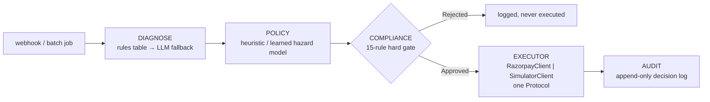

# Vasool

An autonomous recovery agent for failed recurring payments in India: it decides *whether,
when, and on which rail* to retry each failed debit, executes a bounded RBI-compliant recovery
workflow with explicit stopping rules, and reports rupees recovered against Razorpay's own
documented retry baseline — with a full, append-only audit trail and zero compliance
violations, asserted by a test that fails the build if that ever stops being true.

## Architecture



Full detail — the `Executor` Protocol trick that makes the benchmark honest, every compliance
rule, and how the audit trail is structured — is in [ARCHITECTURE.md](ARCHITECTURE.md).

## The number

Measured by `make bench` against a 2,000-invoice / 500-customer / 90-day simulated cohort,
committed at [benchmarks/results.json](benchmarks/results.json) so you see it without running
anything:

| Policy | Recovery rate | Recovered | Attempts/recovery | Compliance violations |
|---|---|---|---|---|
| `razorpay_default` (the baseline — Razorpay's documented subscription retry schedule) | 17.9% | ₹236,427.79 | 4.91 | 0 |
| `static_1_3_7` (fixed T+1/T+3/T+7) | 24.6% | ₹329,955.97 | 7.37 | 0 |
| `dunning_only` (message, never retry) | 9.8% | ₹120,453.28 | 4.93 | 0 |
| **`heuristic`** (this project — payday-aware, downtime-gated) | **46.2%** | **₹668,118.66** | 4.08 | 0 |

`heuristic` recovers **2.6× the invoices and 2.8× the rupees** of `razorpay_default`, on the
same 2,000-invoice batch — every arm in the table above at `compliance_violations: 0`
(`tests/test_compliance_invariants.py` runs the full policy set and fails the build on the
first one).

`learned` — a LightGBM hazard model estimating `P(success | t, class, context)` behind an
expected-value planner — is trained on one held-out half of the cohort (cohort A) and scored
only on the other (cohort B, 938 invoices never seen during training), paired directly against
`razorpay_default` on the identical population:

> **+₹234.57 recovered per invoice** (learned − razorpay_default), 95% bootstrap CI
> **[₹205.74, ₹264.25]**, 2,000 resamples.

That lift survives real misspecification, not just this one seed. Re-running with
`world.yaml`'s parameters perturbed ±30–50% — payday distribution shifted, downtime rate
doubled, hard-decline mix tripled, engagement halved — the paired lift over
`razorpay_default` never drops below **+159%** and reaches **+321%** under a halved-engagement
world (full table: [benchmarks/robustness.md](benchmarks/robustness.md)). This sweep, not the
headline number, is the credible claim — see **What this is not**, below.

Where the lift comes from, isolated one mechanism at a time
([benchmarks/ablation.png](benchmarks/ablation.png)): reason-awareness alone recovers
₹228,404.80 on cohort B; adding payday inference brings it to ₹282,645.73; adding EV-based
stopping, ₹330,641.70; adding dunning messages for genuinely unrecoverable invoices,
₹331,373.50 (`learned`'s final number above). Reason-awareness and payday timing are the
dominant contributors in this run — worth saying plainly rather than crediting every mechanism
equally.

## Run it — `docker compose up`

```
git clone <this repo>
cd vasool
docker compose up
```

Open `localhost:8000`. Measured cold (no cached layers, no `.env` file): **77 seconds** from
`docker compose up` to the dashboard responding, dominated entirely by dependency install
(LightGBM, pandas, matplotlib) — the app itself starts serving within 2 seconds of the
container coming up. No API keys required: the LLM runs in stub mode (rules-first
classification, template messages — see below), and the dashboard boots with a small seeded
cohort so there's a full reasoning chain to click through immediately, alongside the real
`benchmarks/results.json` numbers above.

- **Dashboard** (`/`) — at-risk queue, recovery-by-failure-class, the head-to-head chart above, degraded-mode badges (`llm` / `model` / `razorpay`).
- **Decision inspector** (`/inspector`) — click any seeded invoice: the failure event, classification, inferred payday with its credible interval, downtime state at decision time, every compliance rule evaluated, candidate slots with their expected values, the chosen action, the stop rule, the outcome.
- **DLQ** (`/admin/dlq`) — webhook deliveries whose processing raised, held for inspection and manual replay.

## Where we deliberately did not use an LLM

The LLM never decides timing, probability, retry eligibility, or anything that touches money
arithmetic. Concretely, it is never on the path that:

- decides *when* to retry, or on which rail
- estimates `P(success)` for any candidate slot (that's a LightGBM model trained on observed
  outcomes, in `policy/hazard.py` — no LLM output ever enters that training data)
- decides whether a hard decline is retry-eligible (a fixed table, `diagnose/rules.py`)
- computes a recovered amount, an expected value, or any `Money` arithmetic (`domain/money.py`
  is `int` paise, boundary to boundary — never a float, never touched by an LLM)
- approves or rejects a compliance rule (`compliance/guard.py` is pure Python, no I/O, no LLM)

What it *is* used for, always with a deterministic fallback and never load-bearing: classifying
an error string the rules table doesn't recognize (`diagnose/llm_fallback.py`, constrained to
the `FailureClass` enum plus a confidence score — below threshold becomes `UNKNOWN`, never a
guessed class presented as certain); drafting the customer-facing message in English, Hindi or
Hinglish (`comms/generate.py`, validated against the canonical amount/date/merchant-name and
an opt-out line before it can ever be sent — a string-equality check, not a vibe check);
compiling a merchant's natural-language policy request into a typed, Pydantic-validated rule
that a human must explicitly confirm before it activates (`llm/policy_compiler.py`); writing a
batch root-cause narrative over deterministically-computed failure counts
(`llm/narrative.py`); and turning one structured audit decision into a plain-English sentence
for the dashboard (`audit/explain.py`). Anthropic unavailable → rules and templates, logged,
`degraded: llm` on the dashboard, `make bench` produces the identical number either way
(`tests/test_llm_fallback.py` proves this directly, not just by matching totals).

## What this is not

> The 2,000-invoice batch is synthetic. The lift is measured against a simulator whose
> parameters are documented in [ASSUMPTIONS.md](ASSUMPTIONS.md), sourced where public sources
> exist and marked as estimates where they don't. The learned policy is trained on data
> generated by that simulator, so the absolute number is not a forecast of real-world
> performance; the robustness sweep above is there to show which part of the result survives
> parameter misspecification. On real merchant data the hazard model would need recalibration
> and the payday prior would be re-fit. The live loop against Razorpay test-mode APIs is one
> subscription end to end, not the batch.

## Repo map

```
vasool/
├── README.md, ARCHITECTURE.md, ASSUMPTIONS.md, CLAUDE.md, build-docs/
├── docker-compose.yml, Dockerfile, Makefile, pyproject.toml, .env.example
├── src/vasool/
│   ├── domain/        types, enums, Money (int paise), FailureClass, Attempt, RecoveryPlan
│   ├── diagnose/       rules table, LLM fallback classifier
│   ├── policy/         baselines, heuristic, learned, hazard model, payday inference, planner, Thompson exploration
│   ├── compliance/      rule engine (15 rules), sourced constants, per-issuer token buckets
│   ├── execute/         RazorpayClient | SimulatorClient — one Protocol, idempotency, circuit breaker
│   ├── comms/           message generation, validators, templates
│   ├── audit/           append-only decision log, LLM explanation layer
│   ├── sim/              causal generative world, world.yaml, cohort generation
│   ├── bench/            harness, metrics, ablation, robustness sweep, plots
│   ├── api/              webhooks, dashboard, decision inspector, admin DLQ
│   ├── llm/              Anthropic client (stub-mode fallback), narrative, policy compiler
│   └── chaos.py          `make chaos` — 7 fault-injection scenarios
├── scripts/              seed.py, bench.py, live_demo.py
├── tests/                310 tests, including test_compliance_invariants.py
└── benchmarks/            results.json, report.md, robustness.md, plots — committed deliberately
```

## Running the benchmark

```
make install     # creates .venv, installs the pinned toolchain
make bench       # regenerates benchmarks/results.json, report.md, the plots above (~90s)
make test        # 310 tests, ~13s, includes test_compliance_invariants.py
make chaos       # 7 fault-injection scenarios against the real code paths above (~2s)
```

`benchmarks/results.json` and the report PNGs are committed deliberately — you see the number
above without running anything. `make bench` reproduces it from the same seed, byte for byte
(`tests/test_determinism.py` asserts this).

## Running the live loop

```
make up          # dashboard + webhook receiver at localhost:8000, seeded data, no credentials needed
make live        # scripts/live_demo.py — one real recovery loop against a real Razorpay test-mode account
```

`make live` needs real `RAZORPAY_KEY_ID` / `RAZORPAY_KEY_SECRET` **test-mode** credentials in
your environment (copy `.env.example` → `.env`) and walks you through it interactively: create
a Plan and Subscription, authorize the mandate in your browser, trigger a real "Charge as
Failure" from the Razorpay Dashboard (test-mode only, no API for it), then Vasool classifies
the real failure, decides with the real policy layer, and creates a real test-mode Payment
Link. It polls Razorpay's fetch APIs rather than consuming real webhooks — receiving a real
webhook needs a public HTTPS tunnel pointed at `make up`, out of scope for a single unattended
script — documented in the script's own header. Test-mode limits that apply: max 30 Payment
Links per business, card tokens valid 3 days, UPI Payment Links are not available in test mode
at all.
